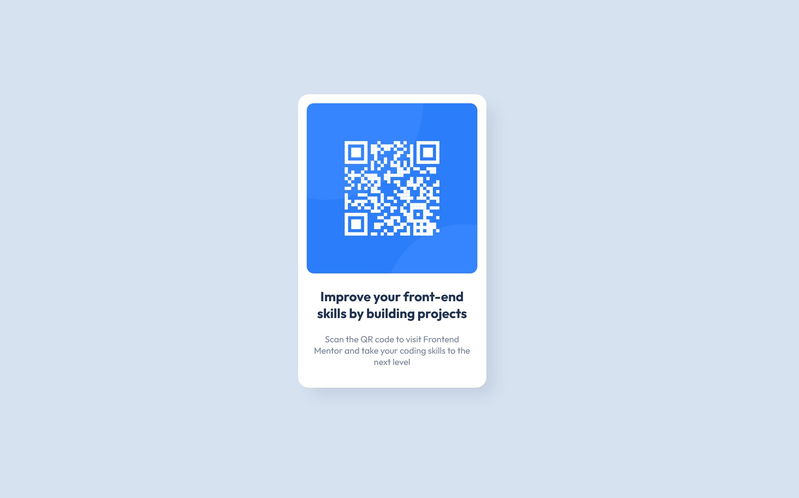

# Frontend Mentor - QR code component solution

This is a solution to the [QR code component challenge on Frontend Mentor](https://www.frontendmentor.io/challenges/qr-code-component-iux_sIO_H). Frontend Mentor challenges help you improve your coding skills by building realistic projects.

## Table of contents

- [Overview](#overview)
  - [Screenshot](#screenshot)
  - [Links](#links)
- [My process](#my-process)
  - [Built with](#built-with)
  - [What I learned](#what-i-learned)
  - [Continued development](#continued-development)
- [Author](#author)

## Overview

### Screenshot



### Links

- Live Site URL: [Add live site URL here](https://stv-devl.github.io/QR-code-component/)

## My process

### Built with

- Semantic HTML5 markup
- CSS custom properties
- Flexbox
- CSS Grid

### What I learned

Using Flexbox for create a card

```css
.flexbox {
  display: flex;
  flex-direction: column;
  align-items: center;
  background-color: white;
  width: 320px;
  height: 500px;
  border-radius: 18px;
  box-shadow: 17px 17px 24px -5px rgba(123, 135, 157, 0.2);
}
```

### Continued development

I would like to try same kind project with Grid

## Author

- Website - [Steven-Dev](https://github.com/Stv-devl)
- Frontend Mentor - [@Stv-devl](https://www.frontendmentor.io/profile/Stv-devl)
